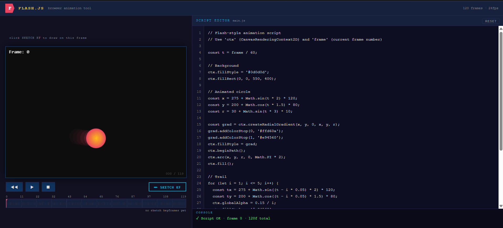

# ✏️ Flash.js — Browser-Based Animation Tool

A lightweight, Adobe Flash-inspired animation tool that runs entirely in the browser. Write JavaScript to animate on a canvas stage, draw sketch keyframes with your mouse, and scrub through a timeline — no plugins, no installs, just the web platform.

> Built with React · Canvas API · No external animation libraries



---

## ✨ Features

- **JavaScript Script Editor** — write JS directly against the Canvas 2D API using `ctx` and `frame` variables
- **✏️ Sketch Keyframes** — draw freehand poses directly on the stage with your mouse, stored per frame
- **🧅 Onion Skinning** — ghost the previous sketch keyframe so you can trace and animate poses frame-by-frame
- **🎨 Brush Toolbar** — 7 colors, 5 brush sizes, eraser, and per-frame clear
- **Timeline Scrubber** — click anywhere on the timeline to jump to a frame; playhead shows current position
- **💎 Keyframe Diamonds** — sketch keyframes appear as cyan diamonds on the timeline (just like Flash)
- **Transport Controls** — Play, Pause, Stop, Rewind at 24fps
- **Live Error Console** — script errors are caught and displayed without crashing the tool
- **Line-numbered Editor** — monospace script editor with live line numbers

---

## 🚀 Getting Started

### Prerequisites

- [Node.js](https://nodejs.org/) v18+
- npm v9+

### Installation

```bash
# 1. Clone the repo
git clone https://github.com/MuratDoka2/Flash-inspired.git
cd flash-tool

# 2. Create a Vite + React project
npm create vite@latest . -- --template react

# 3. Replace src/App.jsx with the flash-tool component
#    (copy App.jsx from this repo into src/)

# 4. Install dependencies
npm install

# 5. Start the dev server
npm run dev
```

Then open **http://localhost:5173** in your browser.

### Build for Production

```bash
npm run build
# Output is in /dist — drop it anywhere as a static site
```

---

## 🎬 How to Use

### Writing Animations

In the **Script Editor** on the right, write JavaScript. You have access to two variables:

| Variable | Type                       | Description                    |
| -------- | -------------------------- | ------------------------------ |
| `ctx`    | `CanvasRenderingContext2D` | The canvas drawing context     |
| `frame`  | `number`                   | Current frame number (0 – 119) |

**Example:**

```js
const t = frame / 60;

ctx.fillStyle = "#0d0d0d";
ctx.fillRect(0, 0, 550, 400);

const x = 275 + Math.sin(t * 2) * 120;
const y = 200 + Math.cos(t * 1.5) * 80;

ctx.fillStyle = "#ffd60a";
ctx.beginPath();
ctx.arc(x, y, 30, 0, Math.PI * 2);
ctx.fill();
```

The script re-runs every frame during playback.

### Sketch Keyframes

1. Scrub to any frame on the timeline
2. Click **✏ SKETCH KF** — the stage border glows blue
3. Draw directly on the canvas with your mouse
4. Scrub to another frame and draw again
5. Toggle **◎ ONION** to see the previous keyframe ghosted behind your current drawing
6. Click **✏ SKETCHING** again to exit sketch mode and play back

Sketch keyframes appear as **◆ cyan diamonds** on the timeline.

### Timeline

- **Click** anywhere on the timeline to jump to that frame
- **Diamonds** mark frames that have sketch keyframes
- The **red playhead** shows your current position

---

## 🗂️ Project Structure

```
flash-tool/
├── index.html          # Entry point — add global reset styles here
├── src/
│   ├── main.jsx        # React root
│   └── App.jsx         # The entire Flash.js tool (single component)
├── package.json
└── vite.config.js
```

---

## 🛠️ Tech Stack

| Technology                  | Role                                 |
| --------------------------- | ------------------------------------ |
| [React](https://react.dev/) | UI & state management                |
| [Vite](https://vitejs.dev/) | Build tool & dev server              |
| Canvas 2D API               | Animation rendering & sketch drawing |
| CSS-in-JS (inline styles)   | Styling — zero dependencies          |

No external animation libraries. No CSS frameworks. Just React and the browser.

---

## 🗺️ Roadmap

- [ ] Multiple named layers
- [ ] Motion tween between keyframes
- [ ] Easing curve editor
- [ ] Export to GIF / WebM video
- [ ] Object picker & properties panel
- [ ] Save / load project as JSON
- [ ] Keyboard shortcuts

---

## 🤝 Contributing

Contributions, issues, and feature requests are welcome!

1. Fork the repo
2. Create a branch: `git checkout -b feature/my-feature`
3. Commit your changes: `git commit -m 'Add my feature'`
4. Push to the branch: `git push origin feature/my-feature`
5. Open a Pull Request

---

## 📄 License

MIT License — feel free to use, modify, and distribute.

---

## 💬 Questions?

Have questions or want to follow the build journey? Find me on socials: **create mvp**

---

<p align="center">Made with ✏️ and the open web platform</p>
